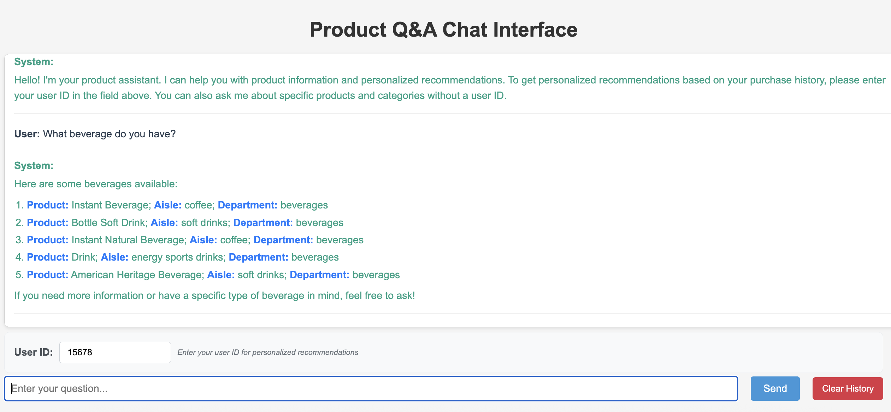
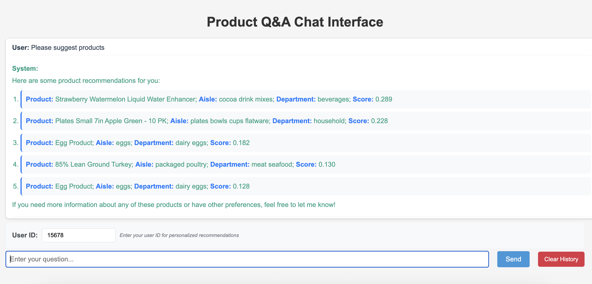

# IMBA Chatbot - Product Recommendation System

A sophisticated product recommendation system that combines collaborative filtering (ALS - Alternating Least Squares) with RAG (Retrieval-Augmented Generation) capabilities. This system provides intelligent product recommendations through a conversational interface.




## 🚀 Features

- **Hybrid Recommendation Engine**: Combines collaborative filtering (ALS) with semantic search
- **Conversational AI**: Natural language interface for product discovery
- **Vector Search**: Semantic product search using embeddings
- **Real-time Recommendations**: Dynamic recommendation generation
- **Session Management**: Maintains conversation context across interactions
- **Docker Support**: Easy deployment with Docker and Docker Compose

## 🏗️ Architecture

The system consists of several key components:

1. **ALS Model**: Collaborative filtering for user-based recommendations
2. **Vector Store**: Semantic search using Qdrant
3. **LangChain Agent**: Conversational AI with tool integration
4. **FastAPI Backend**: RESTful API with WebSocket support
5. **Web Interface**: Simple HTML/JavaScript frontend

## 📋 Prerequisites

- Python 3.8+
- Docker and Docker Compose (optional)
- OpenAI API key

## 🛠️ Installation

### Option 1: Local Development

1. **Clone the repository**
   ```bash
   git clone <repository-url>
   cd imba_chatbot
   ```

2. **Install dependencies**
   ```bash
   pip install -r requirements.txt
   ```

3. **Set up environment variables**
   ```bash
   # Create .env file
   echo "OPENAI_API_KEY=your_openai_api_key_here" > .env
   ```

4. **Prepare data**
   ```bash
   # Place your data files in the data/ directory:
   # - products.csv
   # - orders.csv
   # - order_products__train.csv.gz
   # - order_products__prior.csv.gz
   # - departments.csv
   # - aisles.csv
   ```

5. **Run the application**
   ```bash
   python main.py
   ```

### Option 2: Docker Deployment

1. **Build and run with Docker Compose**
   ```bash
   docker-compose up --build
   ```

2. **Or build and run manually**
   ```bash
   docker build -t imba-chatbot .
   docker run -p 8000:8000 imba-chatbot
   ```

## 📊 Data Requirements
The system expects the following data files in the `data/` directory. You can download the dataset from Kaggle:

Dataset Source: [Simplified Instacart Data](https://www.kaggle.com/datasets/brendanartley/simplifiedinstacartdata)

Download the dataset and extract the required CSV files to the `data/` directory.

### Dataset Schema

#### `orders.csv` (3.4M rows, 206K users)
- `order_id`: Order identifier
- `user_id`: Customer identifier  
- `eval_set`: Evaluation set this order belongs in (prior/train/test)
- `order_number`: Order sequence number for this user (1 = first, n = nth)
- `order_dow`: Day of the week the order was placed on
- `order_hour_of_day`: Hour of the day the order was placed on
- `days_since_prior`: Days since the last order, capped at 30 (with NAs for order_number = 1)

#### `products.csv` (50K rows)
- `product_id`: Product identifier
- `product_name`: Name of the product
- `aisle_id`: Foreign key to aisles table
- `department_id`: Foreign key to departments table

#### `aisles.csv` (134 rows)
- `aisle_id`: Aisle identifier
- `aisle`: Name of the aisle

#### `departments.csv` (21 rows)
- `department_id`: Department identifier
- `department`: Name of the department

#### `order_products__SET.csv.gz` (30M+ rows)
- `order_id`: Foreign key to orders table
- `product_id`: Foreign key to products table
- `add_to_cart_order`: Order in which each product was added to cart
- `reordered`: 1 if this product has been ordered by this user in the past, 0 otherwise

Where `SET` is one of the following evaluation sets:
- **"prior"**: Orders prior to that user's most recent order (~3.2M orders)
- **"train"**: Training data supplied to participants (~131K orders)
- **"test"**: Test data reserved for machine learning competitions (~75K orders)

### Required Files
- `products.csv`: Product information
- `orders.csv`: Order information
- `order_products__train.csv.gz`: Training order-product relationships
- `order_products__prior.csv.gz`: Prior order-product relationships
- `departments.csv`: Department information
- `aisles.csv`: Aisle information

## 🎯 Usage

### Web Interface

1. Open your browser and navigate to `http://localhost:8000`
2. Start a conversation with the chatbot
3. Ask questions like:
   - "What products would you recommend for me?"
   - "Find products similar to [product name]"
   - "What are the best products in [category]?"

### API Endpoints

- `GET /`: Web interface
- `GET /health`: Health check
- `POST /chat`: Chat endpoint
- `POST /clear_history`: Clear conversation history
- `POST /retrain`: Retrain models

### Example API Usage

```bash
# Chat with the system
curl -X POST "http://localhost:8000/chat" \
  -H "Content-Type: application/json" \
  -d '{
    "message": "What products would you recommend for me?",
    "session_id": "user123"
  }'

# Clear conversation history
curl -X POST "http://localhost:8000/clear_history" \
  -H "Content-Type: application/json" \
  -d '{"session_id": "user123"}'
```

## 🔧 Configuration

### Environment Variables

- `OPENAI_API_KEY`: Your OpenAI API key (required)
- `QDRANT_HOST`: Qdrant host (default: localhost)
- `QDRANT_PORT`: Qdrant port (default: 6333)

### Model Parameters

The ALS model and vector store can be configured in `main.py`:

- `factors`: Number of latent factors for ALS (default: 50)
- `iterations`: Number of ALS iterations (default: 50)
- `regularization`: Regularization parameter (default: 0.01)

## 🧪 Testing

The system includes health checks and can be tested using:

```bash
# Health check
curl http://localhost:8000/health

# Test chat endpoint
curl -X POST "http://localhost:8000/chat" \
  -H "Content-Type: application/json" \
  -d '{"message": "Hello", "session_id": "test"}'
```

## 📁 Project Structure

```
imba_chatbot/
├── main.py              # Main application file
├── requirements.txt      # Python dependencies
├── Dockerfile           # Docker configuration
├── docker-compose.yml   # Docker Compose configuration
├── .gitignore          # Git ignore rules
├── README.md           # This file
├── data/               # Data files (not in git)
│   ├── products.csv
│   ├── orders.csv
│   ├── order_products__*.csv.gz
│   ├── departments.csv
│   └── aisles.csv
├── static/             # Static web files
│   ├── index.html
│   ├── script.js
│   └── style.css
└── als_model.pkl       # Trained ALS model (not in git)
```

## 🤝 Contributing

1. Fork the repository
2. Create a feature branch (`git checkout -b feature/amazing-feature`)
3. Commit your changes (`git commit -m 'Add some amazing feature'`)
4. Push to the branch (`git push origin feature/amazing-feature`)
5. Open a Pull Request

## 📝 License

This project is licensed under the MIT License - see the LICENSE file for details.

## 🆘 Troubleshooting

### Common Issues

1. **OpenAI API Key Error**
   - Ensure your OpenAI API key is set in the `.env` file
   - Verify the API key has sufficient credits

2. **Data Loading Errors**
   - Check that all required CSV files are in the `data/` directory
   - Verify CSV file formats match expected schema

3. **Model Training Issues**
   - Ensure sufficient memory for large datasets
   - Consider reducing `factors` parameter for memory constraints

4. **Docker Issues**
   - Ensure Docker and Docker Compose are installed
   - Check port 8000 is not already in use

### Performance Optimization

- For large datasets, consider using a smaller `factors` value
- Increase `regularization` if overfitting occurs
- Use GPU acceleration if available for vector operations


